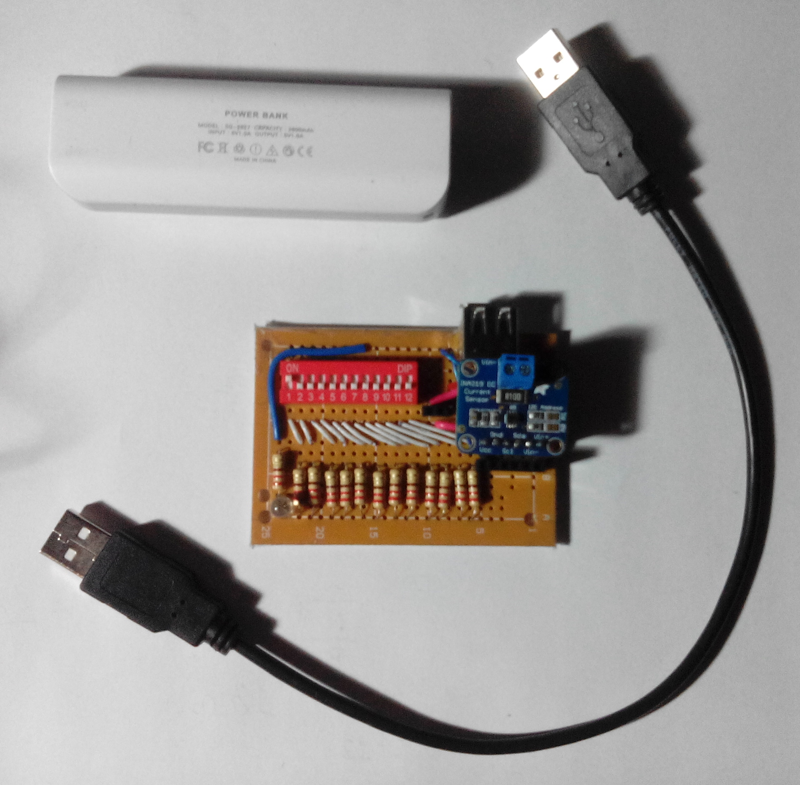
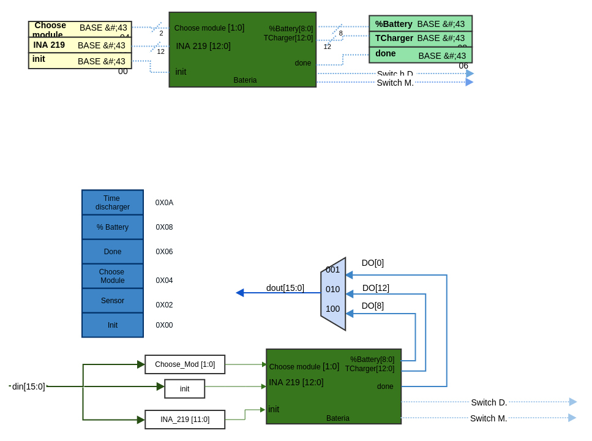

**Tabla de contenido**
 
[TOC]
#Presentación

Bienvenidos al espacio diseñado por nosotros, Karen Atsumi, Julian Navarrete y Nicolas Ospina para compartir los avances en torno al desarrollo del área específica escogida del proyecto general debatido en el aula del curso de electrónica digital I, grupo 3.

Contactos:
Karen Atsumi Osako
Código: 25451569
Correo institucional: kaosako@unal.edu.co

Julian Camilo Navarrete Rubio
Código: 25451582
Correo institucional: jcnavarreter@unal.edu.co

Nicolas Ospina Mendivelso
Código: 25451691
Correo institucional: nospinam@unal.edu.co

Esta NO es una web oficial de la universidad nacional de Colombia, somos un grupo de estudiantes que crearon la página para exponer el desarrollo de un proyecto de la asignatura de electrónica digital I (2016498).

#Introducción 

Este proyecto forma parte de una serie de proyectos propuestos por los estudiantes del curso de electrónica digital I de la Universidad Nacional de Colombia con la finalidad de elaborar una bicicleta inteligente capaz de satisfacer una serie de necesidades del usuario que se encuentran planteadas en la wiki general, la necesidad que aquí se ha tratado ha sido la administración de la energía que empleará la bicicleta para su apropiado funcionamiento.  

Partiendo del siguiente cuestionamiento ¿Cuánto tiempo durarán las baterías del proyecto?, buscamos presentar información que permita entender la capacidad de las baterías, además de brindar los medios por los cuales se realizan las mediciones de corriente consumida por un proyecto para de esta manera, lograr hacer estimaciones precisas de la duración de la batería, incluyendo protocolos para el ahorro de la misma ante distintas situaciones de uso.

Para abordar el tema del por que se ha decidido construir este modulo y que función puede cumplir en muchos de los problemas de la vida diaria, se hará una explicación desde un punto de vista general para luego terminar en mostrar como uno de los ejemplos de su implementación recae en la utilización de este elemento en una smart bike.

Como bien es sabido la medición de tensión y corriente cumple un gran papel en muchas de las actividades diarias pero que sin duda ignoramos debido a que nosotros no nos ponemos a censar cada toma en la que conectamos nuestros dispositivos, ni tampoco pensamos en la cantidad de corriente que nos brinda nuestros cargadores, pero si notamos su efecto a la hora de pagar el recibo de la energía eléctrica o cuando nuestros dispositivos eléctricos están averiados o descargados. Por ende el dispositivo que brindamos sirve para realizar justamente la función que se menciono al comienzo y que  esta enfocado a aquellas personas que deseen mediante este interpretar la información que le brinda cada uno de sus dispositivos eléctricos, por ejemplo mediante un continuo seguimiento de la energía consumida por su computador de mesa puede apreciar la cantidad de energía que este gasta y como esto puede afectar su bolsillo, o puede implementarlo de la misma manera para poder determinar cuanto tiempo de carga alberga la batería de su movil o de algún dispositivo eléctrico portátiles. Es importante notar que para realizar estas tareas diarias se necesita una persona capaz de entender e interpretar tales mediciones para luego implementarlas en alguna labor, por ende este dispositivo va dirigido a aquellas personas con los conocimientos  necesarios para saber usar este elemento , tales personas pueden ser: ingenieros, estudiantes de ingeniería de alguna de las ramas que involucre el estudio o aplicación de la energía eléctrica, personas que estén o hayan estudiado un estudiado un técnico en electricidad o electronica o cualquiera de las ramas que involucre la implementación de energía eléctrica o aquellas personas que tengan el conocimiento y las bases necesarias para implementarlo en alguna de sus actividades diarias. 

Las ventajas que ofrece este dispositivo es lo compacto que llega a ser y la precisión que este tiene, además de su ligero peso.

En el sistema de Smart bike su propósito esta enfocado a que por medio de la medición de energía eléctrica se puede determinar la cantidad de energía que queda en la batería de la bicicleta y el tiempo que resta para que este de descargue. Esto es muy importante para que el bici usuario pueda determinar cuanto tiempo puede seguir usando la computadora de la pc y cuanta carga le queda para determinar a partir de esta en que momento es necesaria poner a cargar el dispositivo o si aun puede seguir implementandola en su recorrido.

#Marco teórico 
El módulo de control de bateria buscar ofrecer un método para prever la duración de una bateria, y tambien mostrar el porcentaje que de la carga que contiene la bateria.

##Control de porcentaje y tiempo de batería
En esta sección se implementará los modulos encargados de calcular el porcentaje y el tiempo de carga y descarga de la bateria [más información](control_bateria)

##TIMMER
Este modulo tiene que ser capaz de contar hasta un minuto, entregar una señal de done y poseer un autoreset, dicha señal de done
se enviará cada minuto.
##switch
Este es el modulo encargado de encender y apagar los distintos submódulos asociados a la smartbike a partir de un comando otorgado por interfaz; No podemos conectar los módulos de bloqueo ni de interfaz debido a que estos siempre deben contar con un suministro de energía.	

##i2c_master
Este modulo se encargará de realizar la comunicación a través del protocolo I2C.
[más información](i2c_master)
##bin2bcd
Este modulo se encargará de realizar la conversión entre formato binario normal, en formato binario bdc, para la tradución a ASCII.
[más información](bin2bcd)

#Prototipo placa de testeo 

Esta es la placa que se piensa implementar al momento de realizar las mediciones, la cual tiene la facultad de someter a la bateria a distintos niveles de carga, en este caso particular la bateria a testear tiene una capacidad de 2600 mAh con una salida de 5 Voltios 1 Amperio, por defecto la placa presenta un consumo de 18 miliamperios, sin embargo el encendido de cada switch añadira una carga que consumira 23 miliamperios hasta llegar a un maximo de 295 miliamperios, cabe recalcar que estos valores son meras aproximaciones que pueden verse influenciados por las tolerancias de las resistencias o las impedancias del circuito.

A continuacion se presentan fotos de la placa finalizada

#Diagramas

##Diagrama de flujo 

##Diagrama de caja negra general

##Diagramas de caja negra de los submodulos

##Diagrama J1

##Diagrama detallado de implementacion en forth
**Primera parte**  

**Segunda parte**  

**Tercera parte**  

#Referencias

[^Consumo_bateria]: T.Dicola, *Battery Life & Current Consumption*, Low Power WiFi Datalogger, https://learn.adafruit.com/low-power-wifi-datalogging/battery-life-and-current-consumption, consultado el 12 de marzo de 2016.

