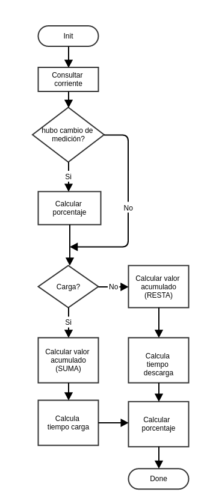
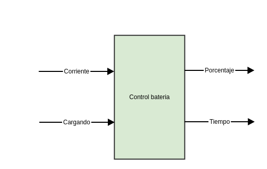

[HOME](Home)

# Control de bateria #

La capacidad de una batería es especificada en miliamperios hora (mAh), esta indica la cantidad  maxima de corriente constante, que puede drenar la batería durante 1 hora, o la cantidad de horas que puede durar una bateria con un drenage constante de 1mA.
Con la capacidad de la batería y el consumo de corriente promedio se puede calcular el tiempo que durará la bateria.

Capacidad de la batería (en mAh) / Consumo de corriente promedio (in mA) = Horas

Por ejemplo una de 800 mAh debería estar en la capacidad de proveer:

* 800 mA durante 1 hora
* 1mA durante 800 horas 
* 20mA durante 40 horas
* 100mA durante 8 horas

antes de descargarse por completo.

De esa forma podemos tener un control sobre la batería a través de la medición actual de la corriente, tanto de carga como de descarga de una bateria.

Con la idea de un integrador (sumador), se puede tener el control de cuanta capacidad todavia resta en la bateria o cuanta falta para cargarla totalmente. Para la descarga se puede ir restando de un acumulador, el gasto de la bateria en cada instante de uso hasta que llegue a cero. De igual manera se puede carcular la carga hasta que llegue a la carga total. 

Para calcular el gasto o la carga de una bateria, es necesário utilizar dos factores que afectan esta medida. El tiempo de medición de la corriente, que puede estar tanto entrando a la bateria, cuando salindo y la cantidad gasta o de carga.

El tiempo de exposición a un gasto específico se puede medir, pensando en que una bateria de X[V] tiene capacidad de Z[Ah], una capacidad medidas por hora, de modo que en un minuto con esta misma bateria con una corriente de Z[A] gastaria apenas una parte de la capacidad total equivalente a 0,016667 de la capacidad total y su gasto total en un segundo seria 0.000278.

* **1 [min] = 1/60 [h] = 0,016667 [h]**
* **1 [s] = 1/3600 [h] = 0,000278 [h]**

La cantidad gasta o cantidad de carga puede ser calculada a través de la medición de corriente que entra o sale de la bateria tiempo medido. Por ejemplo si se utiliza apenas 0.5*Z[A] eso indicaria un gasto de 50% de la carga total. De modo que si se gasta G [A], se puede calcular el porcentaje de gasto de la siguiente manera:

* **P_h = m/Z**, 

donde P_h es el porcentaje por hora, m el valor de medición de la corriente (gasto o carga actual), y Z la capacidad de la batería.

De este modo, utilizando estos dos factores podemos calcular el gasto de la bateria en un instante determinado, en el caso utilizamos los segundos.

* **P_s = (m/Z)*(1/3600)**, 

donde (m/Z) indica el porcentaje de gasto, (1/3600) el porcentaje de tiempo de las mediciones y P_s, el porcentaje de gasto o de carga de la bateria.

El valor del acumulador se calcula multiplicando el valor de carga total, multiplicando por el porcentaje, y sumando o restando en el acumulador.

**V_a = V_a (+/-) Z*P_s**,
donde V_a es el valor del acumulador, Z la capacidad total, y P_s el porcentaje del instante medido.

**Es importante resaltar que cuanto menor el tiempo utilizado para las mediciones, mejor será la precisión de las medidas tomadas**

con valor acumulado de la bateria, y tambien el gasto o carga actual, podemos calcular el porcentaje y el tiempo de la bateria. 

## Porcentaje de bateria ##
El porcentaje de la batería se calcula con el valor acumulado multiplicado por 100 y dividido por la capacidad total de la bateria.

**(V_a * 100)/C**,

donde V_a es el valor acumulado y C la capacidad total de la bateria.

## Tiempo bateria ##
Para la carga se utiliza el valor de la carga total, se resta el valor acumulado y se divide por el valor de medición de la corriente.

**(Z-V_a)/m**,
donde Z es la capacidad total, V_a el valor del acumulador y m el valor de medición.

Para la descarga se utiliza el valor acumulado y se divide por el valor de medición de la corriente medida en el instante.

**V_a/m**,
donde Z es la capacidad total, V_a el valor del acumulador y m el valor de medición.

Los valores obtenidos, estarán expresos en el caso en horas, también se puede convertirlo a minutos o a segundos.

## Diagrama de flujo ##

## Diagrama de caja negra ##

## Referencias ##
[^Bateria]: Cálculo de porcentaje de bateria, http://forum.clubedohardware.com.br/topic/456739-como-medir-a-carga-de-uma-bateria.
